# ASHEN DEPTHS

An original idle / auto-battler action RPG for the **TI-Nspire CX / CX CAS
(first generation)**, built around the systems of Diablo IV. Your hero
descends endless procedurally generated dungeon floors alone: pathfinding,
fighting, spending resource on core skills and building it back with basic
skills, firing cooldowns, looting and taking the stairs. You shape the
build (skill tree, paragon board, aspects, crafting) and collect offline
gains when you come back.

The systems follow Diablo IV's design. All code, pixel art, names, items
and story are original.

> 中文：为 TI-Nspire CX 计算器打造的原创放置 ARPG，系统对标暗黑破坏神 4：六大职业、
> 十五幕剧情、楼层事件、悬赏与成就、可玩 300 小时以上；支持简体中文、繁體中文、English、
> 日本語、한국어。下方动图与截图均为游戏本身渲染的真实画面。

## Download (一键下载)

<p align="center">
  <a href="https://github.com/hannnnnnnny/ti-idle-arpg/releases/latest/download/AshenDepths-TI-Nspire.zip"></a>
  <a href="https://github.com/hannnnnnnny/ARPG-CX/releases/latest/download/AshenDepths-Windows.zip"></a>
</p>

**[AshenDepths-TI-Nspire.zip](https://github.com/hannnnnnnny/ti-idle-arpg/releases/latest/download/AshenDepths-TI-Nspire.zip)**
(about 0.3 MB): `AshenDepths.tns` and a short install guide (Ndless required,
see [Install on the calculator](#install-on-the-calculator)). Want to play on
a PC with keyboard, mouse and sound? Grab
**[AshenDepths-Windows.zip](https://github.com/hannnnnnnny/ARPG-CX/releases/latest/download/AshenDepths-Windows.zip)**
from [ARPG-CX](https://github.com/hannnnnnnny/ARPG-CX).

> 中文：点上面的按钮直接下载 zip。计算器版需先装 Ndless，把 `AshenDepths.tns` 拷进 ndless 文件夹即可；
> 想在电脑上用键盘鼠标玩，下载蓝色按钮的 Windows 版，解压双击 exe 就能玩。

## Demo

<p align="center">
  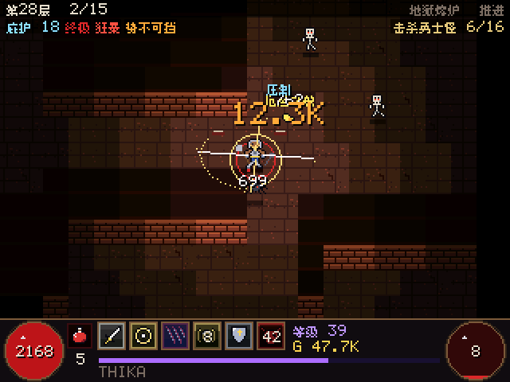
  <br><em>Idle battle on floor 28: an ambush, critical and overpower hits, gold and remarks</em>
</p>

<table>
  <tr>
    <td>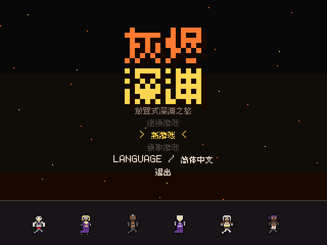</td>
    <td>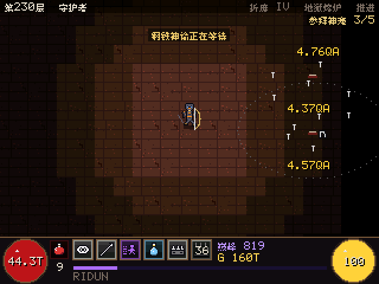</td>
  </tr>
  <tr>
    <td align="center"><em>New game: title, class, appearance, act I subtitles</em></td>
    <td align="center"><em>Hour 120: Torment IV, a guardian, glyph level 100</em></td>
  </tr>
  <tr>
    <td>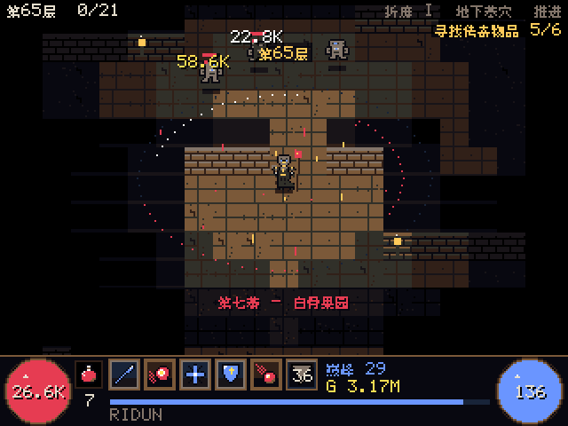</td>
    <td>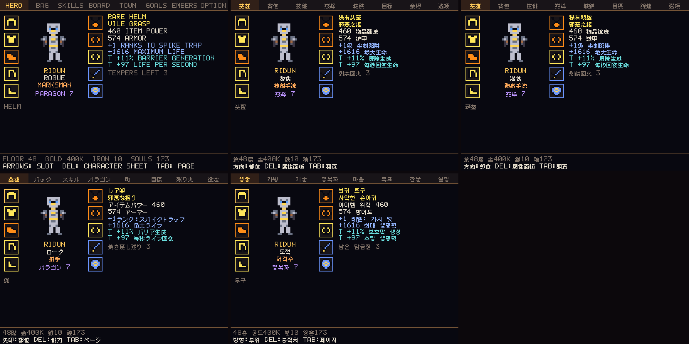</td>
  </tr>
  <tr>
    <td align="center"><em>Hero, bag, skills, paragon, town, goals, embers</em></td>
    <td align="center"><em>English, 简体中文, 繁體中文, 日本語, 한국어</em></td>
  </tr>
</table>

| Title | Battle | Hero |
|---|---|---|
| 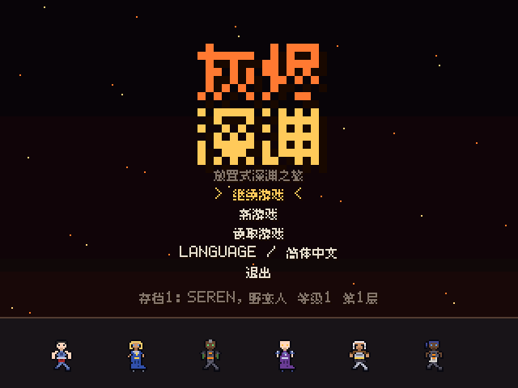 | 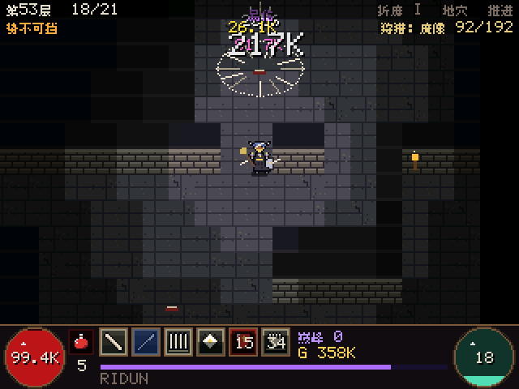 | 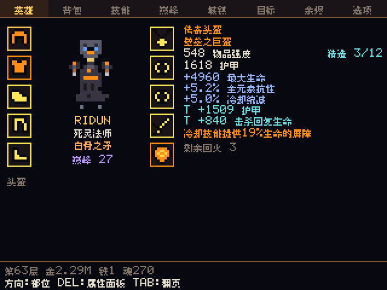 |
| **Skills** | **Paragon** | **Goals** |
| 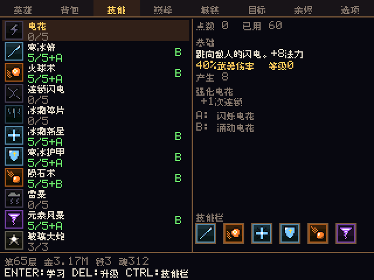 | 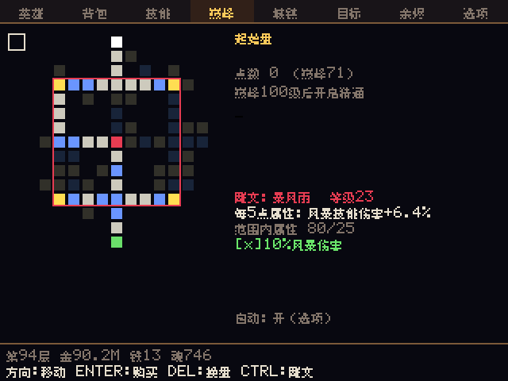 | 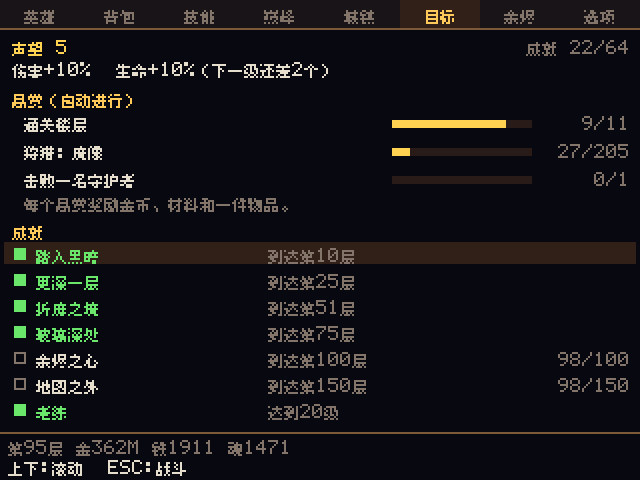 |

Every frame above is rendered by the game's own code at the calculator's
320x240 (shown 2x) through the headless runner, the same renderer the
`.tns` uses; it is not camera footage of a calculator.
`python tools/media/make_media.py` regenerates all of it after a build.

## Meta builds (版本强势流派)

Three signature builds sit at the top of the ladder. Each is switched on
by a **build-defining unique** (dropped by act bosses and guardians) and
pushed further by two class aspects. The signature only wakes with its
skill on the bar; then it reshapes that skill, makes the hero far tougher
([x]8 life, 40% damage reduction) and throws huge, outlined numbers.

<table>
  <tr>
    <td>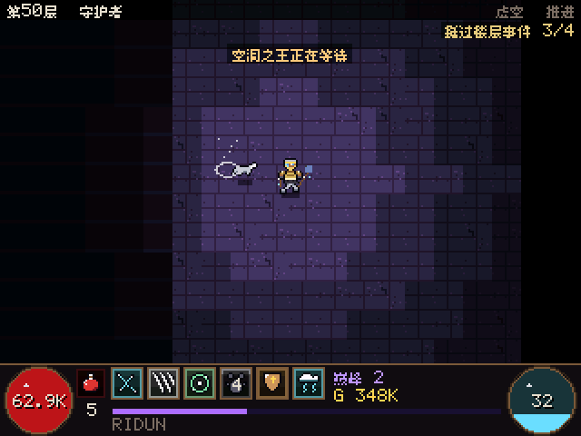</td>
    <td>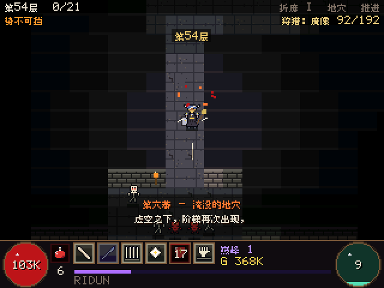</td>
    <td>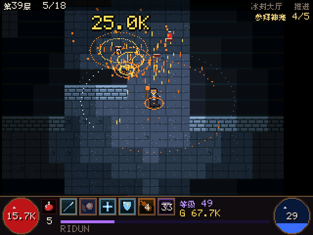</td>
  </tr>
  <tr>
    <td align="center"><b>风暴狼德 Storm Werewolf</b></td>
    <td align="center"><b>骨刺死灵 Bone Spear</b></td>
    <td align="center"><b>火法 Inferno</b></td>
  </tr>
</table>

| Build | Unique | What it does | Aspects |
|---|---|---|---|
| Storm Werewolf (druid, preset STORM WEREWOLF) | Stormhowl Pelt (chest) | Shred becomes free lightning; every hit calls a forked bolt from the sky that heals and shields (life barely moves); Shred lunges at foes up to 80 px away | Stormclaw: bolts chain further. Moonlit Hunt: barrier per bolt, +15% speed |
| Bone Spear (necromancer, preset BONE SPEAR) | Spine of the First Keeper (weapon) | Spears burst into a fan of bone shards, crits erupt in a bone nova that feeds you, every sixth spear is a giant | Splintered Bone: more shards, shards pierce. Marrow Well: novas restore essence and life |
| Inferno (sorcerer, preset PYROMANCER) | Heart of the Inferno (amulet) | Fireballs explode twice and call meteors (screen flash and shake) | Firestorm: meteor showers. Phoenix: burning foes explode on death |

Worn, the unique grows with you: every guardian re-forges it to the
floor's item level (tempers and masterwork kept), and auto equip never
swaps it for ordinary gear. In the long-run simulator (300 hours, all 18
builds) the three lead the ladder from about hour 25 to hour 200 and stay
at the top after that.

## Status

| Target | State |
|---|---|
| Ndless build `AshenDepths.tns` | Compiles with the official Ndless SDK (GCC 14.2), zero warnings |
| Windows desktop simulator | Builds and runs; every screen checked with the headless renderer |
| Tests | 314,533 checks pass: signature builds, loot rules, crafting, skill tree, paragon, paragon mastery and glyph levels, damage pipeline, floor events, bounties and achievements, offline gains, saves (v7 plus real v1/v3 saves converted), every translation's format, glyphs and line width, 200 connected floors, 2-hour idle runs for all 6 classes |
| Physical TI-Nspire CX CAS | Earlier versions ran on the owner's calculator; this version is not yet tested on hardware |

## Classes (6) and builds (3 each)

| Class | Resource | Main stat | Builds |
|---|---|---|---|
| Barbarian | Fury | Strength | Whirlwind Bleed, Earthquake, Berserker |
| Sorcerer | Mana | Intelligence | Pyromancer, Cryomancer, Stormcaller |
| Rogue | Energy | Dexterity | Marksman, Venom, Barrage |
| Necromancer | Essence | Intelligence | Bone Spear, Summoner (skeletons), Blood Surge |
| Druid | Spirit | Willpower | Storm, Earth, Werewolf (wolf pack) |
| Spiritborn | Vigor | Dexterity | Eagle Quills, Jaguar, Centipede |

* **Skill tree:** 10 active skills per class in Basic / Core / Defensive /
  Mastery / Ultimate clusters, 6 passives (3 ranks) and 3 key passives (only
  one active). A skill takes 5 ranks, then an Enhancement, then a choice of
  2 Upgrades. Clusters open as you spend points. 6 skills fit on the bar.
* **Resource:** basic skills generate it, core skills spend it, cooldown
  skills fire on their own timers; channels (Whirlwind) drain per pulse.
* **Builds:** each class has three presets. SKILLS > SWITCH BUILD respecs
  into another (free before level 15, then gold, always confirmed). Doing
  anything by hand turns the auto planner off.
* **Minions:** skeleton warriors / mages, spirit wolves. **Corpses** for
  Corpse Explosion. Statuses: freeze, stun, chill, immobilize, burn, poison,
  bleed, shadow. Hero states: barrier, berserking, unstoppable, imbuements.
* Every skill has its own animated effect, tinted by its current element.

## Damage (Diablo IV buckets)

`weapon x skill% x (1 + main stat/1000) x (1 + sum of +% bonuses) x each [x]
multiplier x Vulnerable (1.2 + vulnerable damage) x Critical (1.5 + crit
damage) x Overpower ((+ life + barrier) x (1.5 + overpower damage))`.
Lucky hits trigger affix effects. Damage numbers are colour coded: white
normal, yellow critical, purple vulnerable, pink both, cyan (big) overpower,
orange overpower + critical, DoTs in their element colour. HERO > DEL shows
the full character sheet and the biggest hit of the floor broken down by
bucket.

## Loot and gold

* Common, Magic (1 affix), Rare (2), Legendary (3 + an aspect), Unique (4
  fixed + a unique power), Mythic Unique. 40 affix types with slot pools;
  every weapon type, ring, amulet and boot has an implicit affix.
* **Ancestral** items (deep floors) have 1-3 greater affixes (x1.5, shown
  with a star) and +100 item power. Legendary and better drops stand in a
  **pillar of light** (orange / gold / purple, taller for ancestral) with a
  banner announcing them.
* **Codex of Power:** every legendary aspect found is remembered (best roll).
* **Town** (where the gold goes): Blacksmith (masterwork 12 ranks, temper 2
  extra affixes from 6 recipes), Occultist (enchant one affix: pick 1 of 2
  or keep; imprint codex aspects), Jeweler (7 gem kinds x 5 tiers, sockets,
  combining), Alchemist (potion upgrades, 30-minute elixirs), Gambler (buy
  unknown gear by slot). Salvaging gives iron and souls.
* Auto craft (option) masterworks, tempers, imprints build aspects,
  sockets gems and keeps an elixir running.

## Paragon

From level 50 (cap 60) paragon points: four 15x15 boards per class with
normal, magic, rare and legendary nodes, a glyph socket on each board and a
gate to the next. Glyphs scale with the main stat in their radius and level
up from Torment guardians. Auto paragon (option) plans the boards.

## Your hero

New game: choose a class, then create the hero (skin, hair style and
colour, face, eyes, clothing colour, name). Equipped helm, chest (with
pauldrons from chain mail up), gloves, pants, boots, weapon and off-hand are
all drawn on the hero in their material colour. OPTIONS > APPEARANCE changes
the look later; SHOW HELM hides the helm.

## Story

An original fifteen-act story (Cindermere under the ash): acts I-V end
with the epilogue on floor 50, acts VI-X (the Torment campaign) with the
finale on floor 100, and acts XI-XV (the deep) take a whole Torment tier
each, down to floor 350. Forty lost pages lie beside fallen adventurers;
the last twenty-four only turn up below floor 100, one every ten floors. The story plays as subtitles over the battle; nothing waits for a
key press. OPTIONS > STORY switches to full pages, OPTIONS > JOURNAL
rereads chapters and pages.

Brother Aldric speaks through the torch he gave the hero, and the hero
answers: one-line remarks on goblins, mythics, near deaths, records and
more, with cooldowns so they stay special.

## Floor events

Most floors hold one event: a treasure goblin (flees, portals away after
12 s; catch it for gold, gems and two rares), a shrine (40 s blessing:
damage, always-crit, triple gold or experience, attack speed, half damage
taken), an ambush, a cursed chest (beat its guardians for a legendary) or a
fallen adventurer with a lost page. Elites are champions with one or two
affixes (fast, sturdy, vampiric, volatile, warded, frenzied) and a name
plate.

## Goals

The GOALS page tracks three automatic bounties (hunt a monster type, slay
champions, clear floors, find legendaries...); a finished bounty pays gold,
materials and an item and is replaced at once. 64 achievements, from the
first hour to the three-hundredth, raise the hero's renown every 4 earned:
+2% damage and life per tier, kept through rebirths.

## The long road (300+ hours)

The campaign is fast: acts I-X take about four hours. After that the game
is built to keep giving for hundreds of hours, offline time included:

* Torment tiers every 50 floors (I at 51, II at 101, ...): a banner, a new
  story chapter, richer loot and champions with up to four affixes.
* Paragon mastery: every paragon level past 100 adds 1% damage and life
  (compounding). Paragon levels cost kills, not raw experience, so going
  deeper cannot snowball; the hero keeps descending, a little slower each
  hour.
* Glyphs level to 100 from every Torment floor cleared (radius grows at
  15 and 46); MIGHT in the ember shop compounds (x1.12 a rank).
* Offline gains cover up to 24 hours (+4 per PATIENCE rank) and count as
  time played.

Measured with the long-run simulator for all 18 builds (idle, no rebirth):
every 25 hours still adds floors, and after 300 hours the builds stand
between floors 280 and 345, so the last chapter is still ahead for most.

## Languages

English, 简体中文, 繁體中文, 日本語 and 한국어. Change it on the title screen
(LANGUAGE row, ENTER or LEFT/RIGHT) or in OPTIONS > LANGUAGE; each save
keeps its own language.

Translations live in `tools/i18n/*.tsv` (English key, then zh-Hans, zh-Hant,
ja, ko; `//` starts a comment). `python tools/i18n/gen_i18n.py` turns them
into `src/i18n/i18n_data.c` and embeds only the glyphs the text uses; it
fails if a translation changes a printf conversion or uses a character the
font lacks (it reads the 8px monospaced BDF files of the font release from
`.tools/fonts/`). `python tools/i18n/extract.py --missing` lists on-screen English
strings that have no translation yet.

CJK text uses the [Fusion Pixel Font](https://github.com/TakWolf/fusion-pixel-font)
8px (c) TakWolf and contributors, SIL Open Font License 1.1; the licence and
those of the fonts it builds on are in `assets/fonts/`.

## Saving

* 3 save slots, CONTINUE / LOAD GAME / NEW GAME, delete with confirmation.
* Saves from earlier versions load automatically: class, level, gold,
  floors, embers, story and options carry over; old gear is re-forged into
  new items of the same slot, rarity and item level; skill points are
  refunded and the closest build is rebuilt. Converted saves cannot be
  opened by the old version any more (current format: v7).
* Autosave every 2 minutes and on exit; CRC-checked, written atomically.

## Controls

| Action | Calculator | Desktop |
|---|---|---|
| Open menu / next page | TAB or MENU | Tab or M |
| Options page | ESC (in battle) | Esc |
| Navigate | arrows or 8/2/4/6 | arrows or WASD |
| Select / learn / buy / equip | ENTER, click or 5 | Enter or Space |
| Secondary (salvage, upgrade, temper, next board, sheet) | DEL | Delete or X |
| Third (lock item, skill on bar, glyph, combine gems) | CTRL | Ctrl or L |
| Back | ESC | Esc |
| FPS overlay | F | F |

## Install on the calculator

Ndless must already be installed. Copy `AshenDepths.tns` into the `ndless`
folder with TI-Nspire Computer Link (replace the old one), then open it from
My Documents. Saves `AshenDepths1.sav.tns` to `AshenDepths3.sav.tns` sit
next to it and are converted on first load.

## Build

```bash
sh tools/build_nspire.sh    # -> dist/AshenDepths.tns (Docker image bitling/ndless-sdk)
sh tools/build_host.sh      # -> build/AshenDepthsDesktop.exe, tests.exe, ad_headless.exe, ad_sim.exe
build/tests.exe
build/ad_sim.exe 2          # 2 idle hours for each of the 18 builds
```

Curves and prices live in `src/game/balance.c`; skill numbers in
`src/game/skills.c`; aspects and uniques in `src/game/aspects.c`.

## License

Code, pixel art and story: [MIT](LICENSE) (c) 2026 Yi Han. The bundled pixel
fonts keep their own SIL Open Font License 1.1 (see `assets/fonts*/`).

> 中文：代码、像素美术与剧情采用 MIT 许可证开源，可自由使用、修改和分发，保留版权声明即可；
> 内置像素字体沿用各自的 SIL OFL 1.1 许可证。
