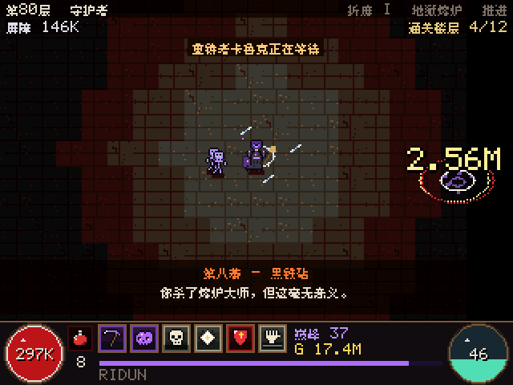
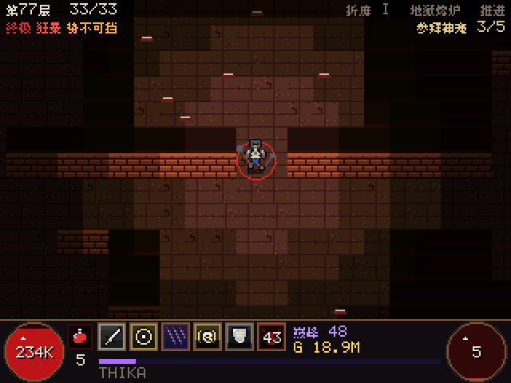
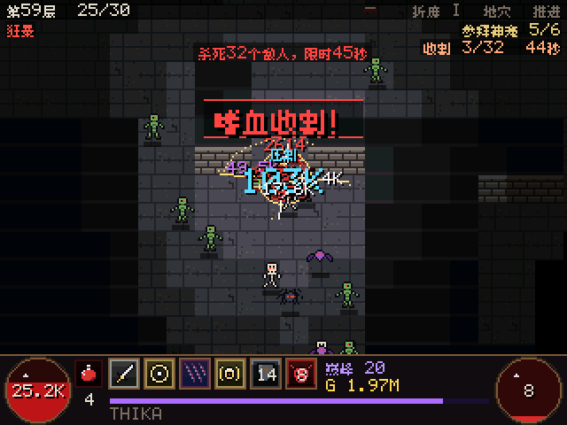

# 灰烬深渊 ASHEN DEPTHS

[English](README.md) | **简体中文**

为 **TI-Nspire CX / CX CAS（第一代）** 计算器打造的原创放置 / 自动战斗动作 RPG，
系统设计对标暗黑破坏神 4。英雄独自深入无尽的随机地牢：寻路、战斗、用核心技能消耗资源、
用基础技能回复资源、释放冷却技能、拾取战利品、走下楼梯。你负责构筑流派（技能树、巅峰盘、
威能、打造），回来时还能领取离线收益。

系统参考暗黑破坏神 4 的设计；所有代码、像素美术、名称、物品和剧情均为原创。

## 一键下载

<p align="center">
  <a href="https://github.com/hannnnnnnny/ti-idle-arpg/releases/latest/download/AshenDepths-TI-Nspire.zip"></a>
  <a href="https://github.com/hannnnnnnny/ARPG-CX/releases/latest/download/AshenDepths-Windows.zip"></a>
</p>

**[AshenDepths-TI-Nspire.zip](https://github.com/hannnnnnnny/ti-idle-arpg/releases/latest/download/AshenDepths-TI-Nspire.zip)**
（约 0.35 MB）：`AshenDepths.tns` 和简短的安装说明（需要 Ndless，见 [安装到计算器](#安装到计算器)）。
想在电脑上用键盘鼠标、带音效玩？下载
**[AshenDepths-Windows.zip](https://github.com/hannnnnnnny/ARPG-CX/releases/latest/download/AshenDepths-Windows.zip)**
（来自 [ARPG-CX](https://github.com/hannnnnnnny/ARPG-CX)），解压双击 exe 就能玩。

## 宣传视频

<p align="center">
  <a href="https://github.com/hannnnnnnny/ARPG-CX/releases/latest/download/ashen_depths_promo.mp4"></a>
  <br><em>32 秒，1080x1920 竖屏。上图为无声预览：
  <a href="https://github.com/hannnnnnnny/ARPG-CX/releases/latest/download/ashen_depths_promo.mp4"><b>下载有声完整版 mp4</b></a></em>
</p>

画面全部为游戏实机录制，音效来自游戏本身的合成音效（在 ARPG-CX 里用
`python tools/media/make_video.py` 生成）。

## 实机演示

<p align="center">
  
  <br><em>第 28 层挂机战斗：伏击、暴击和压制、金币和台词</em>
</p>

<table>
  <tr>
    <td></td>
    <td></td>
  </tr>
  <tr>
    <td align="center"><em>新游戏：标题、职业、外观、第一幕字幕</em></td>
    <td align="center"><em>第 120 小时：折磨 IV、守护者、雕文 100 级</em></td>
  </tr>
  <tr>
    <td></td>
    <td></td>
  </tr>
  <tr>
    <td align="center"><em>英雄、背包、技能、巅峰、城镇、目标、余烬</em></td>
    <td align="center"><em>English、简体中文、繁體中文、日本語、한국어</em></td>
  </tr>
</table>

| 标题画面 | 战斗 | 英雄 |
|---|---|---|
|  |  |  |
| **技能** | **巅峰** | **目标** |
|  |  |  |

以上每一帧都由游戏自身代码以计算器的 320x240 分辨率渲染（放大 2 倍显示），使用的是和 `.tns`
相同的渲染器，不是对着计算器拍的画面。编译后运行 `python tools/media/make_media.py`
可重新生成全部中文素材（加 `--en` 生成英文素材）。

## 版本强势流派

三个招牌流派稳居天梯顶端。每个流派由一件 **流派核心暗金**（幕首领和守护者掉落）
开启，再由两个职业威能进一步强化。只有对应技能放在技能栏上时核心才会生效；
生效后会改造该技能，让英雄变得极其耐打（生命 [x]8、伤害减免 40%），并打出
巨大的描边伤害数字。它还会 **与深渊共鸣**：层数越深，越能抵消怪物随层数增长的
强度，造成和受到的伤害同时生效（第 80 层约 ×4，第 300 层约 ×300，HUD 显示"共鸣"）。

<table>
  <tr>
    <td></td>
    <td></td>
    <td></td>
  </tr>
  <tr>
    <td align="center"><b>风暴狼德</b></td>
    <td align="center"><b>骨刺死灵</b></td>
    <td align="center"><b>陨石火法</b></td>
  </tr>
</table>

| 流派 | 核心暗金 | 效果 | 专属威能 |
|---|---|---|---|
| 风暴狼德（德鲁伊，预设"风暴狼人"） | 风暴嚎叫之皮（胸甲） | 撕碎变为免费的闪电；每次命中召唤分叉天雷，回血并给护盾（血条几乎不动）；撕碎可扑向 80 像素内的敌人 | 风暴之爪：天雷连锁更多敌人。月下狩猎：每道天雷给护盾，移速 +15% |
| 骨刺死灵（死灵法师，预设"白骨之矛"） | 初代守护者之脊（武器） | 骨矛炸成扇形碎骨，暴击引发白骨新星并回复你，每第 6 根是巨型骨矛 | 碎骨：碎片更多且可穿透。骨髓之泉：新星回复精魂和生命 |
| 陨石火法（巫师，预设"火法"） | 炼狱之心（护身符） | 火球爆炸两次并召唤陨石（全屏闪光和震动） | 火焰风暴：陨石成片落下。凤凰：燃烧的敌人死亡时爆炸 |

穿上后，核心暗金会随你成长：每击败一个守护者，它就重铸到当前层的物品等级
（回火和精造保留），自动装备也绝不会用普通装备把它换掉。长线模拟器（全部 18 个流派、
纯挂机、不转生）中，三大流派遥遥领先：

| 流派 | 25 小时 | 100 小时 | 300 小时 |
|---|---|---|---|
| 骨刺死灵 | 294 | 397 | 689 |
| 风暴狼德 | 292 | 436 | 650 |
| 陨石火法 | 296 | 424 | 615 |
| 其他流派最高 | 263 | 303 | 469 |

## 赛季内容：超级先祖暗金、剁肉屠夫、高密度楼层

<table>
  <tr>
    <td></td>
    <td></td>
    <td></td>
  </tr>
  <tr>
    <td align="center"><b>超级先祖暗金</b></td>
    <td align="center"><b>剁肉屠夫</b></td>
    <td align="center"><b>嗜血收割</b></td>
  </tr>
</table>

**超级先祖暗金（神话暗金）。** 共 19 件，所有职业通用，可同时穿多件：新增 17 件，
另有"无名之王的王冠"和"破碎之星"重铸后也拥有专属威能。每种威能都有独立的
战斗逻辑和特效，伤害动辄百万（紫色描边数字），并改变清图方式：

| 部位 | 名称 | 威能 |
|---|---|---|
| 武器 | 裂界者 | 每第 5 次命中释放横扫全屏的新月波，伤害 [x]60% |
| 武器 | 永夜之镰 | 命中时直接收割生命低于 20-30% 的敌人（守护者除外） |
| 副手 | 饥渴虚空之典 | 奇点把整群敌人吸到一起，然后爆裂 |
| 副手 | 静止时光沙漏 | 每 15 秒时间静止 3 秒，被冻结的敌人受到伤害 [x]60-120% |
| 头盔 | 无名之王的王冠 | 星辰如雨坠向敌群，所有技能 +3 级 |
| 头盔 | 千眼冠冕 | 命中时射出三道眼光，暴击伤害 +80% |
| 胸甲 | 不灭者之铠 | 生命 [x]3-5，每 30 秒可拒绝一次死亡 |
| 胸甲 | 龙鳞战甲 | 每秒释放一圈龙焰 |
| 手套 | 雷霆之王的掌握 | 暴击召唤贯穿六个敌人的连锁闪电 |
| 手套 | 百刃之手 | 四柄幽灵之刃环绕英雄 |
| 裤子 | 熔岩行者腿甲 | 每一步都留下燃烧地面，移速 +30% |
| 裤子 | 屠戮者护胫 | 连杀叠加伤害，最高 [x]120-200% |
| 靴子 | 虚空步靴 | 闪现到远处敌人身边并爆发，移速 +50% |
| 靴子 | 深渊潜行者之靴 | 通关楼层时有几率再下坠两层 |
| 护身符 | 毁灭之心 | 被杀死的敌人爆炸 |
| 护身符 | 唯一真名之印 | 伤害 [x]100-160%，所有技能 +2 级 |
| 戒指 | 破碎之星 | 暴击迸发六片星辰碎片 |
| 戒指 | 吞噬之戒 | 把敌群拖到身边并吞噬其生命 |
| 戒指 | 无尽轨道 | 技能无消耗，冷却 -40-60% |

它们非常稀有：每次折磨难度掉落有极小几率，幕首领 0.5%，剁肉屠夫 1%；
模拟器 300 小时内大约能获得 5-27 件。掉落时全屏震动，自动装备一定会穿上，
也绝不会用普通装备把它换掉。

**剁肉屠夫**，致敬暗黑破坏神 4 屠夫的稀有怪：从第 20 层起，大约每 40 个普通楼层
出现一次，守护者楼层不会出现。他会走进楼层，满地图追杀英雄，甩出锁链把英雄拖到
剁刀前，生命低于 40% 时狂暴，击杀奖励堪比守护者（三件传奇、常出暗金、还有机会
掉超级先祖暗金）。

**高密度楼层，每层都有事件。** 每层 26-48 只怪物，3-7 只一群（同屏最多 64 只），
每个普通楼层必定触发一个事件：嗜血收割（45 秒内杀够数量，期间怪物不断涌来）、
诅咒神龛（撑过三波）、血印勇士猎杀（多一个词缀的精英和它的护卫）、地狱裂隙
（持续刷怪 18 秒后崩塌），以及原有的宝藏哥布林、神龛、伏击、诅咒宝箱和倒下的冒险者。
当前目标显示在 HUD 上。

**打击感。** 暴击溅出火花并击退敌人，死去的怪物血肉飞溅，精英和重击会震动屏幕，
并让画面顿帧片刻（顿帧仅在亲自游玩时出现）。

## 状态

| 目标 | 状态 |
|---|---|
| Ndless 版 `AshenDepths.tns` | 使用官方 Ndless SDK（GCC 14.2）编译，零警告 |
| Windows 桌面模拟器 | 可编译运行；每个界面都用无界面渲染器检查过 |
| 测试 | 316,966 项检查通过：超级先祖暗金、剁肉屠夫、新楼层事件、15 个存档位、流派共鸣、招牌流派、掉落规则、打造、技能树、巅峰盘、巅峰精通和雕文等级、伤害公式、楼层事件、悬赏与成就、离线收益、存档（v7 以及真实 v1/v3 存档转换）、每种语言的格式、字形与行宽、200 个连通楼层、6 个职业各挂机 2 小时 |
| TI-Nspire CX CAS 真机 | 早期版本在作者的计算器上运行过；当前版本尚未在真机上测试 |

## 职业（6 个）与流派（各 3 个）

| 职业 | 资源 | 主属性 | 流派 |
|---|---|---|---|
| 野蛮人 | 怒气 | 力量 | 旋风流血、地震、狂战士 |
| 巫师 | 法力 | 智力 | 火法、冰法、召雷者 |
| 游侠 | 能量 | 敏捷 | 神射手流、毒液、弹幕 |
| 死灵法师 | 精魂 | 智力 | 白骨之矛、召唤师（骷髅）、鲜血涌动 |
| 德鲁伊 | 灵力 | 意志 | 风暴、大地、狼人（狼群） |
| 灵巫 | 活力 | 敏捷 | 鹰羽、美洲豹、蜈蚣 |

* **技能树：** 每个职业 10 个主动技能，分为基础 / 核心 / 防御 / 精通 / 终极五组，
  另有 6 个被动（3 级）和 3 个关键被动（只能激活一个）。技能升满 5 级后可强化，
  再从 2 个升级中选一。投入点数会解锁后续技能组，技能栏可放 6 个技能。
* **资源：** 基础技能产生资源，核心技能消耗资源，冷却技能按自己的计时释放；
  引导技能（旋风斩）每次脉冲消耗资源。
* **流派：** 每个职业有三个预设。技能 > 切换流派 可重置并切换（15 级前免费，之后花金币，
  始终需要确认）。手动调整任何东西都会关闭自动规划。
* **召唤物：** 骷髅战士 / 法师、灵狼。**尸体** 可用于尸爆。状态：冰冻、眩晕、冰缓、
  定身、燃烧、中毒、流血、暗影。英雄状态：护盾、狂暴、势不可挡、灌注。
* 每个技能都有独立的动画特效，并按当前元素着色。

## 伤害（暗黑 4 式乘区）

`武器 x 技能% x (1 + 主属性/1000) x (1 + 所有 +% 加成之和) x 每个 [x] 乘区
x 易伤 (1.2 + 易伤伤害) x 暴击 (1.5 + 暴击伤害) x 压制 ((+ 生命 + 护盾) x (1.5 + 压制伤害))`。
幸运一击触发词缀效果。伤害数字按颜色区分：白色普通、黄色暴击、紫色易伤、粉色易伤暴击、
青色（大号）压制、橙色压制暴击，持续伤害显示为其元素颜色。英雄页按 DEL 显示完整属性面板，
以及本层最大一击按乘区的拆解。

## 战利品与金币

* 普通、魔法（1 词缀）、稀有（2）、传奇（3 + 威能）、暗金（4 个固定词缀 + 暗金威能）、
  超级先祖暗金（神话，自带专属威能）。40 种词缀，按部位分池；每种武器、戒指、
  护身符和靴子都有固有词缀。
* **先祖** 物品（深层掉落）有 1-3 个强化词缀（x1.5，带星号标记），物品强度 +100。
  传奇及以上掉落会立起 **光柱**（橙 / 金 / 紫，先祖更高），并有横幅提示。
* **威能宝典：** 找到的每个传奇威能都会被记住（保留最好的数值）。
* **城镇**（金币的去处）：铁匠（精造 12 级、回火从 6 种配方追加 2 条词缀）、
  玄秘商人（附魔一条词缀：二选一或保留；拓印宝典里的威能）、珠宝匠（7 种宝石 x 5 阶、
  打孔、合成）、炼金师（药水升级、30 分钟药剂）、赌博商人（按部位购买未知装备）。
  分解获得铁料和灵魂。
* 自动打造（选项）会精造、回火、拓印流派威能、镶嵌宝石并保持药剂生效。

## 巅峰

50 级（上限 60 级）起获得巅峰点数：每个职业四块 15x15 的巅峰盘，包含普通、魔法、
稀有和传奇节点，每块盘有一个雕文孔和通往下一块的门。雕文按其半径内的主属性成长，
击败折磨守护者可升级。自动巅峰（选项）会自动规划。

## 你的英雄

新游戏：选择职业，然后创建英雄（肤色、发型和发色、脸型、眼睛、衣服颜色、名字）。
装备的头盔、胸甲（锁甲以上带肩甲）、手套、裤子、靴子、武器和副手都会按材质颜色
画在英雄身上。之后可在 选项 > 外观 修改，"显示头盔"可隐藏头盔。

## 剧情

原创的十五幕剧情（灰烬之下的辛德梅尔）：第 I-V 幕在第 50 层迎来尾声，第 VI-X 幕
（折磨篇）在第 100 层迎来终章，第 XI-XV 幕（深渊篇）每幕占一整个折磨难度，直到第 350 层。
四十页遗失书页散落在倒下的冒险者身旁，最后二十四页只在第 100 层以下出现，每十层一页。
剧情以字幕形式在战斗中播放，不需要按键等待。选项 > 剧情 可切换为整页显示，
选项 > 日志 可重温章节和书页。

阿尔德里克修士通过他交给英雄的火把说话，英雄也会回应：遇到哥布林、神话装备、
濒死、破纪录等时会说一句话，带冷却，保持新鲜感。

## 楼层事件

每个普通楼层都有一个事件（新事件见上方赛季内容）：宝藏哥布林（逃跑，12 秒后传送离开；
抓住它可获得金币、宝石和两件稀有装备）、神龛（40 秒祝福：伤害、必定暴击、三倍金币或经验、
攻速、受到伤害减半）、伏击、诅咒宝箱（击败守卫获得传奇）或带着遗失书页的倒下冒险者。
精英是带一到两个词缀的勇士（迅捷、坚韧、吸血、爆裂、守护、狂乱），头顶有名牌。

## 目标

目标页追踪三个自动悬赏（猎杀某种怪物、击杀勇士、通关楼层、找到传奇……）；完成的悬赏
奖励金币、材料和一件装备，并立即刷新。64 个成就从第一个小时一直延续到第三百个小时，
每获得 4 个成就提升一级声望：每级伤害和生命 +2%，转生后保留。

## 漫长的旅程（300 小时以上）

战役节奏很快：第 I-X 幕大约四小时。之后游戏会在数百小时内持续提供内容，离线时间也算在内：

* 每 50 层一个折磨难度（第 51 层为 I，第 101 层为 II……）：横幅提示、新剧情章节、
  更丰厚的掉落，精英最多四个词缀。
* 巅峰精通：巅峰 100 级以后，每级伤害和生命 +1%（复利）。巅峰等级消耗的是击杀数而不是
  经验，所以越深入不会滚雪球；英雄会持续下潜，每小时稍慢一点。
* 每通关一个折磨楼层，雕文都会升级，最高 100 级（15 级和 46 级时半径增大）；
  余烬商店里的"威力"按复利成长（每级 x1.12）。
* 离线收益最多 24 小时（每级"耐心"+4 小时），计入游玩时间。

长线模拟器（全部 18 个流派、纯挂机、不转生）实测：每 25 小时仍在推进层数；
300 小时后普通流派在第 352 到 469 层之间，三大招牌流派在第 615 到 689 层之间，
所有人都还有更深的深渊要闯。

## 语言

English、简体中文、繁體中文、日本語、한국어。可在标题画面（LANGUAGE 行，按 ENTER 或左右键）
或 选项 > 语言 中切换；每个存档保留自己的语言。

翻译位于 `tools/i18n/*.tsv`（英文键，然后是简中、繁中、日文、韩文；`//` 开头为注释）。
`python tools/i18n/gen_i18n.py` 会把它们生成为 `src/i18n/i18n_data.c`，只嵌入文本用到的字形；
如果某条翻译改变了 printf 格式符，或用了字体里没有的字符，生成会失败（它从 `.tools/fonts/`
读取字体发布包里的 8px 等宽 BDF 文件）。`python tools/i18n/extract.py --missing`
列出还没有翻译的屏幕文字。

中日韩文字使用 [缝合像素字体 Fusion Pixel Font](https://github.com/TakWolf/fusion-pixel-font)
8px，(c) TakWolf 及贡献者，SIL Open Font License 1.1；它及其所基于字体的许可证位于 `assets/fonts/`。

## 存档

* 15 个存档位（滚动列表），继续游戏 / 读取游戏 / 新游戏，删除需二次确认。
* 旧版本存档会自动读取：职业、等级、金币、层数、余烬、剧情和选项都会保留；旧装备会被重铸成
  同部位、同稀有度、同物品等级的新装备；技能点退还并重建最接近的流派。转换后的存档不能再被
  旧版本打开（当前格式：v7）。
* 每 2 分钟和退出时自动存档；带 CRC 校验，原子写入。

## 操作

| 动作 | 计算器 | 电脑 |
|---|---|---|
| 打开菜单 / 下一页 | TAB 或 MENU | Tab 或 M |
| 选项页 | ESC（战斗中） | Esc |
| 移动选择 | 方向键或 8/2/4/6 | 方向键或 WASD |
| 选择 / 学习 / 购买 / 装备 | ENTER、click 或 5 | Enter 或空格 |
| 次要操作（分解、升级、回火、下一块盘、属性面板） | DEL | Delete 或 X |
| 第三操作（锁定物品、技能上栏、雕文、合成宝石） | CTRL | Ctrl 或 L |
| 返回 | ESC | Esc |
| 帧率显示 | F | F |

## 安装到计算器

需要先安装 Ndless。用 TI-Nspire Computer Link 把 `AshenDepths.tns` 拷进 `ndless` 文件夹
（覆盖旧文件），然后在"我的文档"里打开。存档 `AshenDepths1.sav.tns` 到
`AshenDepths15.sav.tns` 会出现在同一目录，旧存档首次读取时自动转换。

## 编译

```bash
sh tools/build_nspire.sh    # -> dist/AshenDepths.tns（Docker 镜像 bitling/ndless-sdk）
sh tools/build_host.sh      # -> build/AshenDepthsDesktop.exe、tests.exe、ad_headless.exe、ad_sim.exe
build/tests.exe
build/ad_sim.exe 2          # 18 个流派各挂机 2 小时
```

数值曲线和价格在 `src/game/balance.c`；技能数值在 `src/game/skills.c`；威能和暗金在
`src/game/aspects.c`。

## 许可证

代码、像素美术与剧情：[MIT](LICENSE) (c) 2026 Yi Han，可自由使用、修改和分发，保留版权声明即可。
内置像素字体沿用各自的 SIL Open Font License 1.1（见 `assets/fonts*/`）。
